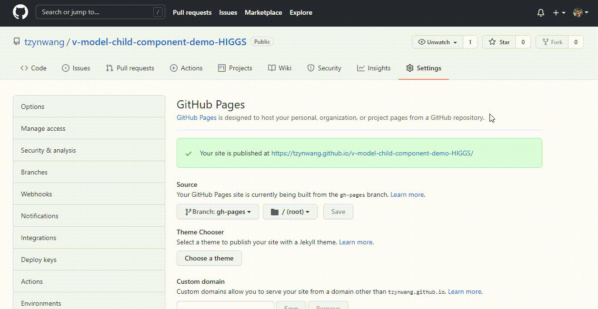

# Vue child component two-way data binding DEMO
URL: https://tzynwang.github.io/v-model-child-component-demo-HIGGS/

## Description
- Source codes are in the files: `src/App.vue` and `src/components/inputComponent.vue`
- Bind data in `App.vue` to `inputComponent.vue` via props, and emit the new input value from `inputComponent.vue` to `App.vue`.

